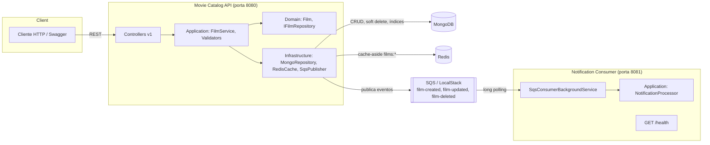

# Cinemark — Movie Catalog & Notification Consumer

Solução Cinemark Brasil: um
catálogo de filmes (**Movie Catalog API**) e um serviço de notificações
(**Notification Consumer**) que consome os eventos de domínio publicados pelo
catálogo via SQS/LocalStack.

Stack: **.NET 9**, MongoDB, Redis (cache-aside), AWS SQS via LocalStack, Serilog
(JSON estruturado), FluentValidation, Swagger/OpenAPI, xUnit + Moq + FluentAssertions + Coverlet.

---

## 1. Visão geral da arquitetura

Dois microsserviços independentes, cada um em camadas **API → Application →
Domain → Infrastructure**, organizados como monorepo com uma única solução
(`CinemarkMovieCatalog.slnx`).



**Fluxo de escrita (POST/PUT/DELETE /films):** valida entrada (FluentValidation) →
verifica regra de negócio (título duplicado) → persiste no MongoDB → invalida
chaves de cache relacionadas → publica o evento de domínio no SQS (best-effort,
ver [Trade-offs](#6-trade-offs-e-suposições-assumidas)).

**Fluxo de leitura (GET /films, /films/{id}):** cache-aside — tenta o Redis
primeiro; em miss (ou Redis indisponível), consulta o MongoDB e repovoa o cache.

---

## 2. Setup via Docker Compose

Pré-requisitos: Docker Desktop (ou Docker Engine + Compose v2) instalado e em execução.

```bash
# a partir da raiz do repositório
docker compose up -d --build
```

Isso sobe, em um único comando:

| Serviço | Container | Porta host |
|---|---|---|
| MongoDB | `cinemark-mongodb` | 27017 |
| Redis | `cinemark-redis` | 6379 |
| LocalStack (SQS) | `cinemark-localstack` | 4566 |
| Movie Catalog API | `cinemark-movie-catalog-api` | 8080 |
| Notification Consumer API | `cinemark-notification-consumer-api` | 8081 |

As 3 filas SQS (`film-created`, `film-updated`, `film-deleted`) são criadas
automaticamente pelo script `docker/localstack-init/init-sqs.sh`, executado
pelo hook `ready.d` do LocalStack assim que o container fica saudável — não é
necessário nenhum passo manual.

Ambas as APIs só iniciam depois que MongoDB, Redis e LocalStack reportam
`healthy` (`depends_on: condition: service_healthy`).

- Swagger — Movie Catalog: http://localhost:8080/swagger
- Swagger — Notification Consumer: http://localhost:8081/swagger
- Health check — Movie Catalog: http://localhost:8080/health
- Health check — Notification Consumer: http://localhost:8081/health

Para derrubar o ambiente:

```bash
docker compose down          # mantém os volumes (dados do Mongo/LocalStack)
docker compose down -v       # remove também os volumes
```

### Rodando localmente sem Docker (apenas as APIs)

Suba só a infraestrutura (`docker compose up -d mongodb redis localstack`) e
rode as APIs com `dotnet run` a partir de `src/MovieCatalog.Api` e
`src/NotificationConsumer.Api` — os arquivos `appsettings.Development.json`
já apontam para `localhost`.

---

## 3. Rodando os testes e o relatório de cobertura

```bash
# build sem warnings (gate de qualidade do projeto)
dotnet build CinemarkMovieCatalog.slnx -warnaserror

# testes de cada serviço com coleta de cobertura (Coverlet via collector do VSTest)
dotnet test tests/MovieCatalog.UnitTests/MovieCatalog.UnitTests.csproj \
  --collect:"XPlat Code Coverage" --results-directory ./coverage/movie-catalog \
  -- DataCollectionRunSettings.DataCollectors.DataCollector.Configuration.Format=cobertura

dotnet test tests/NotificationConsumer.UnitTests/NotificationConsumer.UnitTests.csproj \
  --collect:"XPlat Code Coverage" --results-directory ./coverage/notification-consumer \
  -- DataCollectionRunSettings.DataCollectors.DataCollector.Configuration.Format=cobertura
```

Cada execução gera um `coverage.cobertura.xml` em
`coverage/<serviço>/<guid>/`. Para um relatório HTML navegável, use o
[ReportGenerator](https://github.com/danielpalme/ReportGenerator):

```bash
dotnet tool install -g dotnet-reportgenerator-globaltool
reportgenerator -reports:"coverage/**/coverage.cobertura.xml" -targetdir:coverage/report -reporttypes:Html
# abra coverage/report/index.html
```

**Resultado medido nesta entrega** (camadas exigidas pelo teste — Application e Domain):

| Serviço | Domain | Application |
|---|---|---|
| MovieCatalog | 100% | 94.8% |
| NotificationConsumer | — (sem projeto Domain, ver seção 6) | 87.1% |

Ambos acima do mínimo de 80% exigido. `MovieCatalog.Infrastructure` e
`NotificationConsumer.Infrastructure` não têm testes unitários — dependem de
MongoDB/Redis/SQS reais e ficariam melhor cobertos por testes de integração
(ex.: Testcontainers), fora do escopo definido para a cobertura obrigatória
(ver seção 6).

---

## 4. Variáveis de ambiente / configurações relevantes

### Movie Catalog API (`src/MovieCatalog.Api/appsettings.json`)

| Chave | Descrição | Default (docker-compose) |
|---|---|---|
| `MongoDb__ConnectionString` | Connection string do MongoDB | `mongodb://mongodb:27017` |
| `MongoDb__DatabaseName` | Nome do banco | `moviecatalog` |
| `MongoDb__FilmsCollectionName` | Coleção de filmes | `films` |
| `MongoDb__MaxConnectionPoolSize` / `MinConnectionPoolSize` | Pool de conexões do driver | `100` / `5` |
| `Redis__ConnectionString` | Endpoint do Redis | `redis:6379` |
| `Cache__FilmDetailTtlMinutes` | TTL do cache `films:{id}` | `5` |
| `Cache__FilmListTtlMinutes` | TTL do cache `films:list:*` | `5` |
| `Sqs__ServiceUrl` | Endpoint do LocalStack | `http://localstack:4566` |
| `Sqs__FilmCreatedQueueUrl` / `FilmUpdatedQueueUrl` / `FilmDeletedQueueUrl` | URLs das filas | ver `docker-compose.yml` |
| `Sqs__AccessKey` / `SecretKey` | Credenciais dummy exigidas pelo SDK (LocalStack não valida) | `test` / `test` |

### Notification Consumer API (`src/NotificationConsumer.Api/appsettings.json`)

| Chave | Descrição |
|---|---|
| `Sqs__ServiceUrl`, `Sqs__FilmCreatedQueueUrl`/`FilmUpdatedQueueUrl`/`FilmDeletedQueueUrl` | Mesmas filas do catálogo |
| `Sqs__PollingWaitTimeSeconds` | Long-polling wait time (default `10`) |
| `Sqs__MaxNumberOfMessages` | Máximo de mensagens por `ReceiveMessage` (default `10`) |

Todas as chaves podem ser sobrescritas por variáveis de ambiente (formato
`Secao__Chave`), como já é feito no `docker-compose.yml`.

---

## 5. Exemplos de chamadas aos endpoints

Arquivos `.http` prontos (compatíveis com a extensão REST Client do VS Code ou
o cliente HTTP nativo do Rider/Visual Studio) em [`http/MovieCatalog.Api.http`](http/MovieCatalog.Api.http)
e [`http/NotificationConsumer.Api.http`](http/NotificationConsumer.Api.http), cobrindo
todas as rotas, incluindo os casos de erro (título duplicado, payload
inválido, id inexistente).

```bash
# criar um filme
curl -X POST http://localhost:8080/api/v1/films \
  -H "Content-Type: application/json" \
  -d '{
        "title": "Duna: Parte Dois",
        "synopsis": "Paul Atreides se une aos Fremen para vingar sua família.",
        "genre": "FiccaoCientifica",
        "releaseDate": "2024-03-01T00:00:00Z",
        "durationMinutes": 166,
        "rating": 8.7
      }'

# buscar por id (cache-aside)
curl http://localhost:8080/api/v1/films/{id}

# listar com filtros e paginação
curl "http://localhost:8080/api/v1/films?genre=Drama&active=true&page=1&pageSize=10"

# atualizar
curl -X PUT http://localhost:8080/api/v1/films/{id} \
  -H "Content-Type: application/json" \
  -d '{ "title": "Duna: Parte Dois", "genre": "FiccaoCientifica", "releaseDate": "2024-03-01T00:00:00Z", "durationMinutes": 166, "rating": 9.0, "active": true }'

# soft delete
curl -X DELETE http://localhost:8080/api/v1/films/{id}

# health check do consumer (status da conexão SQS)
curl http://localhost:8081/health
```

Toda resposta de erro (400/404/500) inclui um `correlationId` — o mesmo valor
enviado como header `X-Correlation-Id` (ou gerado automaticamente, se
ausente) e presente nos logs estruturados, para rastreio ponta a ponta.

---

## 6. Trade-offs e suposições assumidas

Pontos em que o enunciado permitia mais de uma interpretação razoável; a
decisão tomada e o motivo estão documentados aqui, em vez de travar a entrega:

1. **Entidade `Film` reaproveitada como documento Mongo.** Em vez de separar
   entidade de domínio e modelo de persistência, `Film` carrega os atributos
   BSON (`[BsonId]`, `[BsonRepresentation]`) diretamente. Isso acopla o Domain
   ao pacote `MongoDB.Bson` (não ao driver/conexão), uma concessão pragmática
   comum em serviços deste tamanho sobre MongoDB — evita um mapper adicional
   sem introduzir dependência de infraestrutura real no domínio.
2. **Falha ao publicar evento no SQS não desfaz a operação principal.** O
   enunciado só pede fallback gracioso explícito para o Redis. Para o SQS,
   assumi a interpretação comum em arquiteturas orientadas a eventos: a
   escrita no MongoDB é a fonte de verdade; se a fila estiver indisponível, o
   erro é logado como `Error` (com `CorrelationId`) mas a API continua
   respondendo 200/201/204 normalmente. A alternativa (falhar a request se o
   evento não for publicado) acoplaria a disponibilidade do catálogo à do
   LocalStack/SQS, o que pareceu pior trade-off para um serviço de catálogo.
3. **Contrato do evento duplicado entre os dois serviços.** `FilmEventMessage`
   existe em `MovieCatalog.Application.Events` e em
   `NotificationConsumer.Application.Events`, sem um pacote/projeto
   compartilhado. Isso é intencional: microsserviços que compartilham um
   contrato de mensageria via biblioteca comum criam acoplamento de deploy
   entre times/serviços; duplicar o DTO (pequeno e estável) é o trade-off mais
   comum nesse nível de granularidade.
4. **`NotificationConsumer` não tem uma camada `Domain` própria.** A estrutura
   sugerida no enunciado lista apenas `Application`/`Infrastructure`/`Api`
   para esse serviço — ele não tem um agregado próprio, só processa e loga
   eventos vindos de outro serviço. A regra de negócio (reconhecer tipos de
   evento válidos) ficou em `NotificationConsumer.Application`, que é a camada
   testada para a exigência de cobertura ≥80%.
5. **Verificação de título duplicado é case-insensitive via regex `^title$`
   com opção `i`** (não há índice de texto/collation dedicado). Para o volume
   esperado de um catálogo de filmes, isso é suficiente; um índice
   `caseInsensitive` dedicado seria a evolução natural em produção.
6. **Sem autenticação/autorização.** O enunciado não pede segurança de acesso
   e o foco é a arquitetura interna; não implementei JWT/API Key para não
   adicionar escopo não solicitado.
7. **Índice de paginação composto** cobre `IsDeleted + Active + Genre +
   CreatedAt desc`, que é o padrão de acesso mais comum do endpoint de
   listagem; os campos também têm índices simples individuais, conforme
   pedido explicitamente.

---

## 7. Checklist final — requisito x entregue

### Stack e arquitetura
- [x] .NET 9, camadas API → Application → Domain → Infrastructure em cada serviço
- [x] DI nativo, `appsettings.json` + `appsettings.{Environment}.json`
- [x] Serilog em JSON estruturado (console + arquivo) nos dois serviços
- [x] Monorepo com `.slnx` único (formato de solução atual do SDK 10 usado para gerar o projeto; abre normalmente no Visual Studio/Rider/VS Code)

### Movie Catalog API
- [x] Modelo `Film` completo (todos os campos do enunciado)
- [x] Connection pooling configurado (`MaxConnectionPoolSize`/`MinConnectionPoolSize` via `MongoClientSettings`)
- [x] `IRepository<T>` genérico reutilizável + `IFilmRepository` especializado
- [x] Soft delete com filtro automático em todas as leituras (`DefaultFilter()` no repositório)
- [x] Índices: Genre, Active, IsDeleted, composto de paginação, título
- [x] Endpoints versionados `/api/v1/films` (POST/GET id/GET lista/PUT/DELETE)
- [x] FluentValidation com mensagens específicas por campo
- [x] Duplicidade de título case-insensitive antes de criar/atualizar
- [x] Cache-aside no Redis (TTL configurável, chaves `films:{id}` / `films:list:{filtros}`, invalidação em write)
- [x] Fallback gracioso do Redis (log `Warning`, nunca derruba a API)
- [x] Eventos `FilmCreated`/`FilmUpdated`/`FilmDeleted` publicados no SQS via LocalStack, payload com `Id`, `Title`, `EventType`, `Timestamp`, `CorrelationId`
- [x] 400/404/500 com `CorrelationId`, middleware global de exceções

### Notification Consumer
- [x] `BackgroundService` consumindo as 3 filas
- [x] Log estruturado por evento (tipo, título, timestamp, correlation id)
- [x] `GET /health` com status da conexão SQS via `Microsoft.Extensions.Diagnostics.HealthChecks`
- [x] Processo/container independente do Movie Catalog API

### Qualidade e testes
- [x] xUnit + Moq + FluentAssertions
- [x] Cobertura ≥80% em Application/Domain nos dois serviços (medido: ver seção 3)
- [x] `dotnet build -warnaserror` passa sem warnings
- [x] Sem `.Result`/`.Wait()` — async/await ponta a ponta
- [x] Níveis de log apropriados (Information/Warning/Error)

### Documentação
- [x] Swagger habilitado nos dois serviços, com anotações (`SwaggerOperation`, `ProducesResponseType`) e XML comments com exemplos de payload
- [x] README com arquitetura, setup Docker Compose, testes/cobertura, variáveis de ambiente, exemplos de chamadas
- [x] Arquivos `.http` cobrindo todas as rotas (equivalente à coleção Postman pedida como diferencial)

### Gaps conhecidos (declarados, não omitidos)
- [ ] **Testes de integração para Infrastructure** (MongoRepository/RedisCacheService/SqsEventPublisher) não foram implementados — exigiriam Testcontainers ou os próprios containers do compose; a exigência de cobertura do enunciado é explicitamente sobre Application/Domain, que estão cobertas.
- [ ] **Rate limiting / autenticação** não implementados — não solicitados no enunciado.
- [ ] **Retry/backoff com DLQ para o consumer SQS** não configurado no LocalStack (mensagem com erro fica na fila para nova tentativa via visibility timeout padrão, mas não há uma dead-letter queue dedicada) — mencionado aqui como possível evolução, não bloqueante para o escopo local pedido.
#
